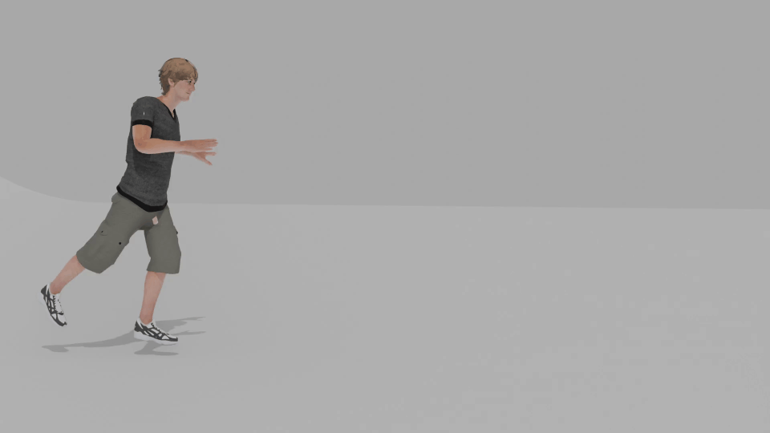
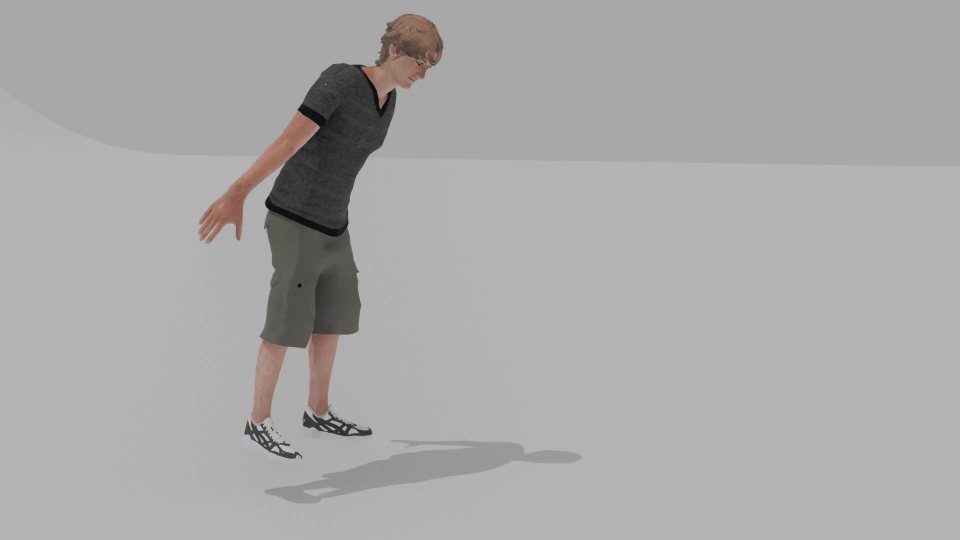
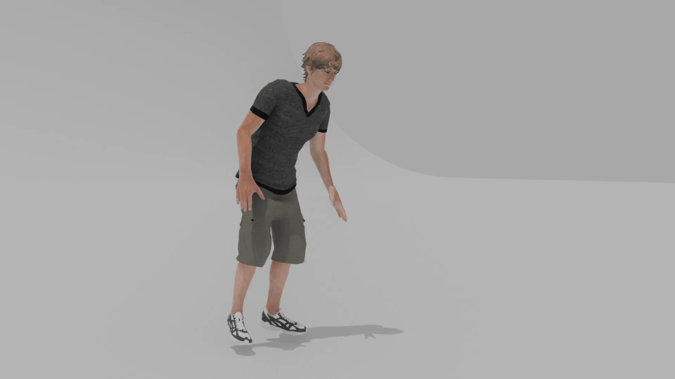
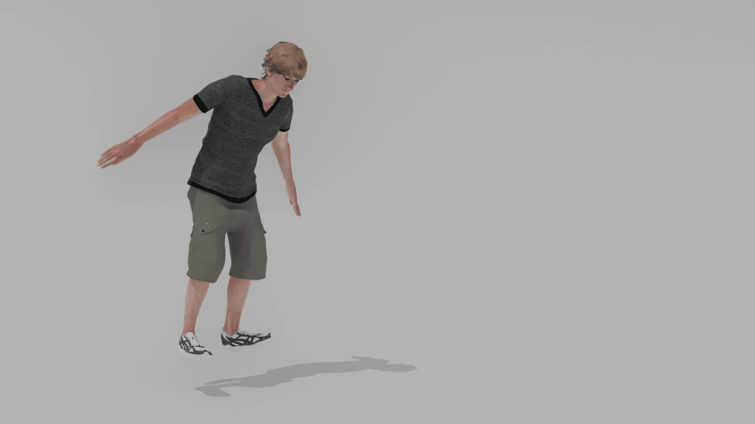
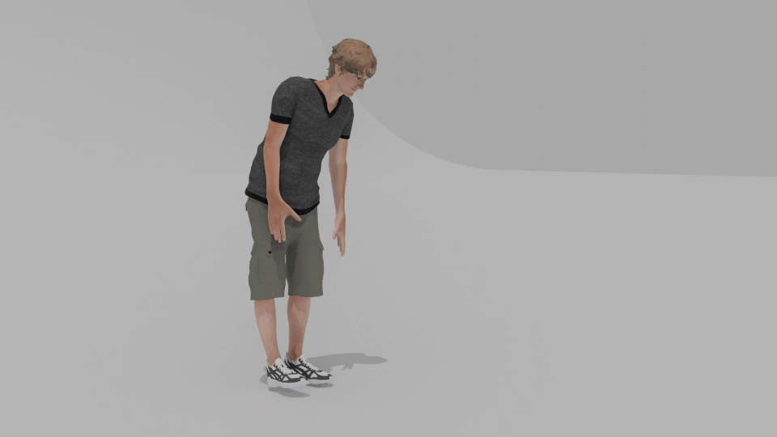
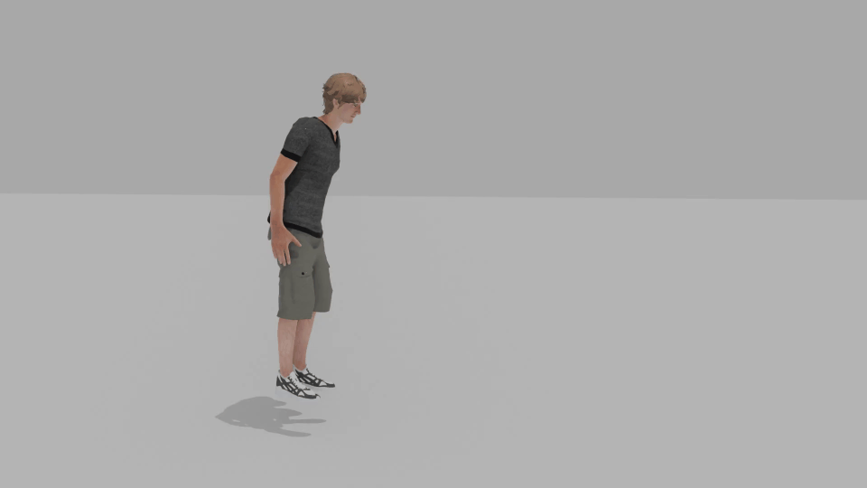

# AStF: Motion Style Tranfer via Adaptive Statistics Fusor
This is the official implementation of "AStF: Motion Style Tranfer via Adaptive Statistics Fusor". We provide several visualized qualitative results below. Our code will be released upon acceptance.  

## Friendly Reminder: Due to the large number of GIF files, some files may take time to load. If a GIF appears static or fails to display, please wait a moment or directly refresh it to fully load. The complete visualization results will appear soon.

    

Our AStF effectively transfers style between two motions, while preserving contents.

## Visualization Results in Xia dataset
|                                                 Style Motion                                                 | Childlike Walk      |    Netrual Walk       | Old Punch    | Angry Kick       |
|:------------------------------------------------------------------------------------------------------------:|:----------------------------------------------------------------------------:|:-----------------------------------------------------------------------:|:----------------------------------------------------------------|:----------------------------------------------------------------------|
|       Content Motion  (Depressed Run)           |     |  |  |  |

|                                             Style Motion                                             |       Old Jump            |        Sexy Run          | Strutting Walk    | Depressed Kick    |
|:----------------------------------------------------------------------------------------------------:|:-------------------------------------------------------------------------:|:-----------------------------------------------------------------------:|:---------------------------------------------------------------------------|:---------------------------------------------------------------------------|
| Content Motion  (Childlike Walk)    |  |  |         |   |

## Visualization Results in BFA dataset
|                            Style Motion                             |      Neutral           | Sneaky    | Zombie              | Proud     |
|:-------------------------------------------------------------------:|:------------------------------------------------------------------------:|:----------------------------------------------------------:|:--------------------------------------------------------------------|:----------------------------------------------------------|
| Content Motion  (Angry)    |                                         |       |  |       |

## Visualization Results for ablation of skewness and kurtosis
|                           |                                Results in Xia dataset                                |                                       Annotation                                        |                         Results in BFA dataset                          |                                                               Annotation                                                               |  
|:-------------------------:|:------------------------------------------------------------------------------------:|:---------------------------------------------------------------------------------------:|:-----------------------------------------------------------------------:|:--------------------------------------------------------------------------------------------------------------------------------------:|
|      Content Motion       |   Childlike Walk         | Childlike style with arms swaying side to side is the style we do not desired to retain |     Angry            | Angry style exhibit straight back, heavy foot steps, straight legs, and arms hanging rigidly downward, which are not desired to retain |
|       Style Motion        |     Old Jump                   | Old style with a hunched back, lowered head, and bent knees is what we aim to transfer  |    Sneaky           |              A sneaky style with a hunched posture, lowered head, quick short foot steps, and forearms extended forward.               |
|     AStF (Full Model)     |               |    Full model effectively transferred the old style while retaining the content walk    |                |                              Full model effectively transferred the sneaky style while retaining content                               |  
|       w/o Skewness        |       |                                   Without lower head                                    |        |                                                        Without hunched posture                                                         |
|       w/o Kurtosis        |       |     The arms exhibit a childlike style, swaying side to side, which is not desired      |        |                                                     Without quick short foot steps                                                     |
| w/o Skewness and Kurtosis |  |                                  Without hunched back                                   |   |                                      Without quick short foot steps and forearms extended forward                                      |

## Visualization Results for Comparison

|          Model Variant          |                                 Motion in GIF format                                  | Annotation                                                                                                                                            |
|:-------------------------------:|:------------------------------------------------------------------------------------:|:------------------------------------------------------------------------------------------------------------------------------------------------------|
| Content Motion (Childlike Jump) |                             | Arms-outstretched is the content that we do not desired to retain                                                                                     |
|  Style Motion (Depressed Walk)  |                                 | Head-down, hunched posture, which represents the style of depressed in the style motion, is what we aim to extract and transfer to the content motion |
|           AStF (Ours)           |             | our AStF effectively transferred the depressed style while retaining the content jump                                                                 |  
|        MoST (Kim et al.)        |           | Lack of depress style expression                                                                                                                      |
|     GenMoStyle (Kim et al.)     |          | Lack of depress style expression                                                                                                                      |
|   MotionPuzzle (Jang et al.)    |  | Lack of content retention                                                                                                                             |
|           Park et al.           |       | Awkward Limbs                                                                                                                                         |

