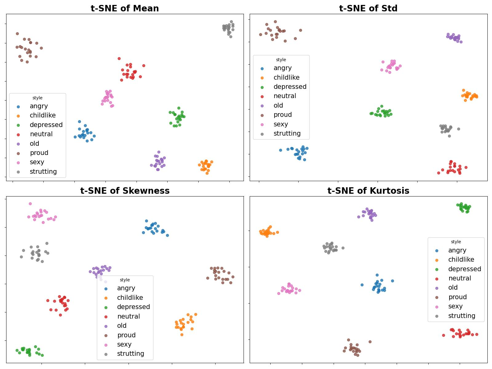

# t-SNE visualization on trained model.

 

### To observe the effect of our trained model, we extracted four statistics from our Simple SDM with the input of style latent code $e_s$ to generate t-SNE visualization. As indicated in figure, the t-SNE visualization exhibits distinct clustering patterns for different motion styles, substantially validating our model has achieved the desired effect in decoupling motion styles

