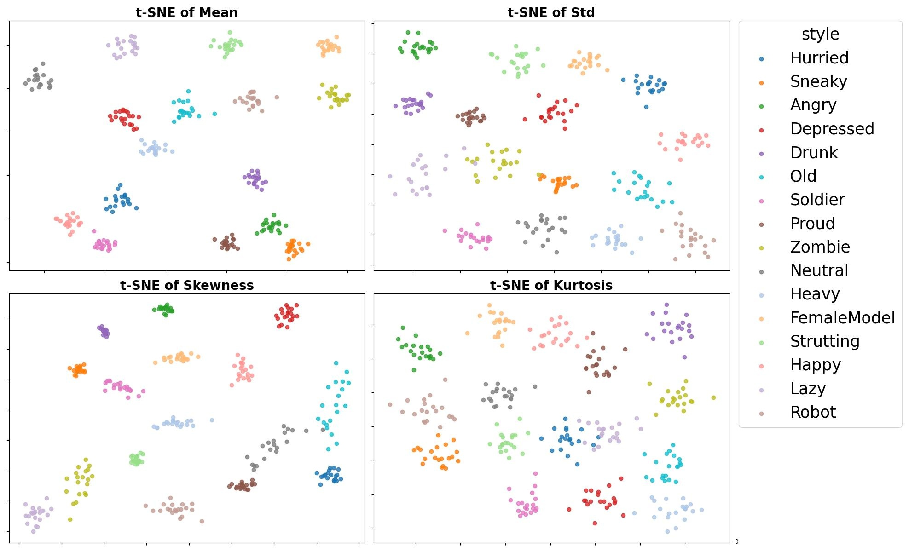

# t-SNE visualization using the larger BFA dataset to reproduce Figure 1

 

### For insufficient t-SNE analysis in Figure 1, we re-generated the t-SNE using the larger BFA dataset. As shown in the figure above, the result remains consistent with those shown in Figure 1 in manuscript.
 

